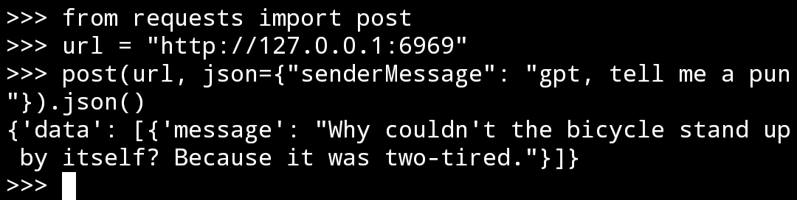
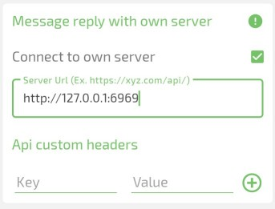
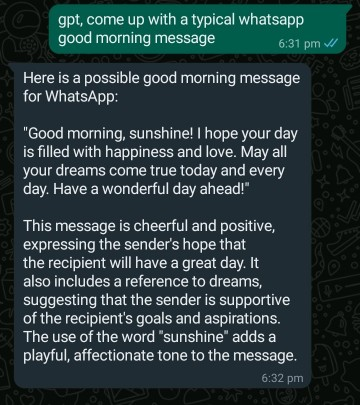

# AI Reply 🤖

An app that lets you automate ChatGPT website on your phone through REST API calls.

https://user-images.githubusercontent.com/53959446/207651878-0062043c-ec63-4e9b-9a0b-95ab72c473e5.mp4

## Usage

Install, launch the app and follow the provided instructions.

Once the automation starts, it launches a local http server running on port `6969` by which things can be automated.

Here is how you can access the API through termux using python



What you send (the message must begin with `gpt, `)

```json
{"senderMessage": "gpt, tell me a pun"}
```

What you receive

```json
{"data": [{"message": "Why couldn't the bicycle stand up by itself? Because it was two-tired."}]}
```

You can connect this to Whatsapp 💬 using [this](https://play.google.com/store/apps/details?id=com.pransuinc.allautoresponderhttps:/) auto reply app. While creating a new rule select `reply with own server` option and paste the url.



And the result


